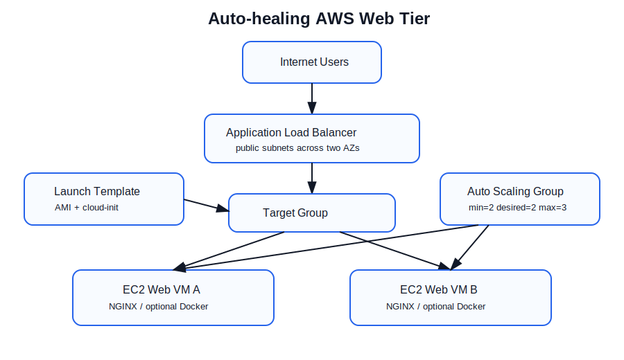
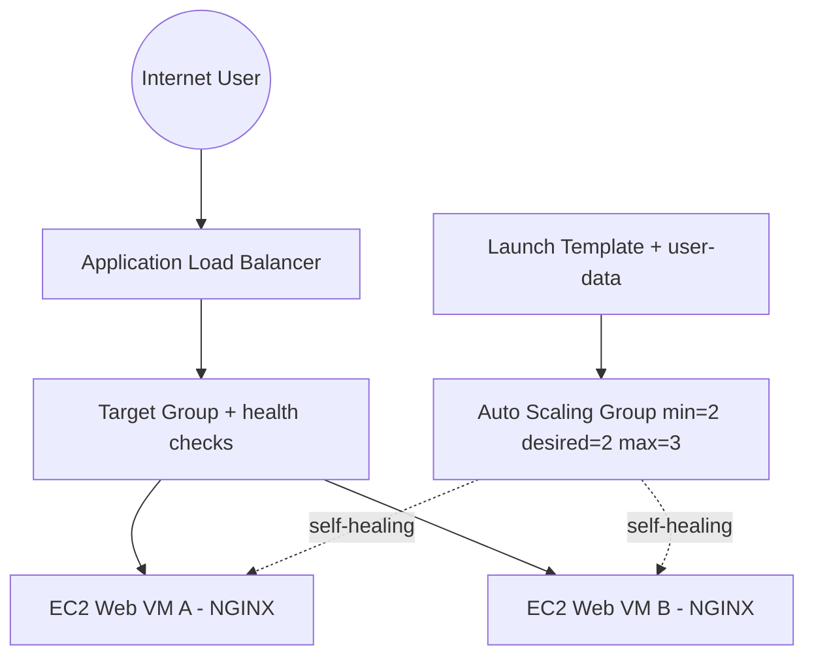

# Auto-healing Web Tier - Terraform AWS

This repository implements an auto-healing, N+1 web tier for the Senior Infrastructure & Cloud Engineer technical exercise. It uses Terraform to create AWS infrastructure where any single web VM can be terminated without application downtime.

## Why AWS

I chose AWS because Auto Scaling Groups, Launch Templates and Application Load Balancers provide a simple, native and well-understood pattern for self-healing web tiers. Terraform support for these resources is mature, readable and easy to validate through `terraform plan` without requiring reviewers to deploy the stack.

## Architecture





## Requirement mapping

| Requirement | Implementation |
|---|---|
| Self-healing | AWS Auto Scaling Group replaces unhealthy or terminated EC2 instances automatically. |
| Self-provisioning / IaC only | Terraform modules; one `terraform apply` creates the stack and a second run should be idempotent. |
| N+1 capacity | ASG defaults to `min_size = 2` and `desired_capacity = 2` across at least two public subnets/AZs. |
| Load balancing | Public Application Load Balancer forwards to a target group with HTTP health checks. |
| Static web page | User-data installs NGINX and writes a welcome page. |
| Templates | Terraform latest-compatible syntax with AWS provider `~> 5.0`. |
| Optional containerisation | Dockerfile included; set `use_container = true` and provide `container_image` to run a container on each VM. |
| Cost awareness | No NAT Gateway; small ARM instances; see `docs/cost-estimate.md`. |

## Repository layout

```text
.
├── main.tf
├── variables.tf
├── outputs.tf
├── versions.tf
├── providers.tf
├── modules/
│   ├── network/
│   ├── security/
│   ├── load_balancer/
│   └── compute/
├── user-data/web.sh.tftpl
├── Dockerfile
├── static/index.html
├── diagrams/
├── docs/cost-estimate.md
└── .github/workflows/terraform.yml
```

## Prerequisites

- Terraform `>= 1.6`
- AWS credentials configured locally, for example via `aws configure`, SSO, or environment variables
- Permission to create VPC, EC2, Auto Scaling and Elastic Load Balancing resources

## Plan

```bash
terraform init
terraform fmt -recursive -check
terraform validate
terraform plan -out=tfplan
```

## Optional apply

Provisioning is optional for this exercise. If applying in a test AWS account:

```bash
terraform apply tfplan
```

After apply, Terraform outputs `application_url`. Open that URL to view the NGINX welcome page.

## Optional self-healing test

After deployment:

1. Find one instance in the Auto Scaling Group.
2. Terminate it manually from the AWS console or CLI.
3. Confirm the ALB remains healthy because another instance is still serving traffic.
4. Confirm the Auto Scaling Group launches a replacement instance and returns to desired capacity.

Example CLI approach:

```bash
ASG_NAME=$(terraform output -raw autoscaling_group_name)
aws autoscaling describe-auto-scaling-groups --auto-scaling-group-names "$ASG_NAME"
# terminate one instance from the returned Instances list
aws ec2 terminate-instances --instance-ids i-xxxxxxxxxxxxxxxxx
```

## Optional container path

A Dockerfile is included for the bonus requirement. To build and push to GitHub Container Registry:

```bash
docker build -t ghcr.io/peterj123/auto-healing-web-tier:latest .
docker push ghcr.io/peterj123/auto-healing-web-tier:latest
```

Then set:

```hcl
use_container   = true
container_image = "ghcr.io/peterj123/auto-healing-web-tier:latest"
```

The EC2 user-data will install Docker, pull the image and run it on port 80.

## Assumptions

- HTTP only is sufficient for this exercise. Production would add ACM-managed TLS and HTTPS listener redirects.
- Public subnets are used to avoid NAT Gateway cost. In production I would normally place instances in private subnets and use a NAT Gateway or VPC endpoints for egress.
- Sydney (`ap-southeast-2`) is used as the default region because the role is Australia-based.
- The exercise says infrastructure provisioning is optional, so the primary review artifact is the Terraform code and plan workflow.
- AWS Free Tier or promotional credits may be required to keep a fully deployed ALB-based design within AUD 20/month; see `docs/cost-estimate.md`.

## Naming and tagging

Resources use the convention:

```text
<project>-<environment>-<component>
```

Default tags include `Project`, `Environment`, `ManagedBy`, `Owner` and `CostCentre`.

## CI pipeline

`docs/terraform-github-actions.yml` is included as an optional GitHub Actions pipeline template. Copy it to `.github/workflows/terraform.yml` to enable it. It runs:

- Terraform format check
- Terraform init without backend
- Terraform validate
- Terraform plan on pull requests when AWS credentials are supplied as repository secrets
- Python repository structure tests
